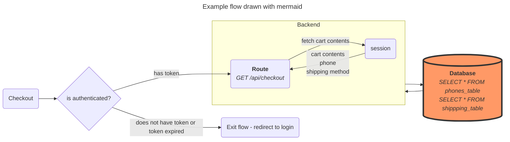

# Flow chart 

```mermaid
---
title: Example flow drawn with mermaid
---
flowchart LR
  frontend(Checkout)

  authCond{is authenticated?}
  
  backend("`
    **Route**
    _GET /api/checkout_
  `")
  database[("`
    **Database**
    _SELECT * FROM phones_table_
    _SELECT * FROM shippping_table_
  `")]

  frontend --> authCond
  
  authCond -- has token --> backend
  authCond -- does not have token or token expired --> exitFlow(Exit flow - redirect to login)
  
subgraph Backend
  backend
  session(session)

  direction TB
  backend -- fetch cart contents --> session
  session -- cart contents <br/> phone <br/> shipping method --> backend
end


Backend ---> database
database --> Backend

style database fill:#f96,stroke:#333,stroke-width:4px
```
