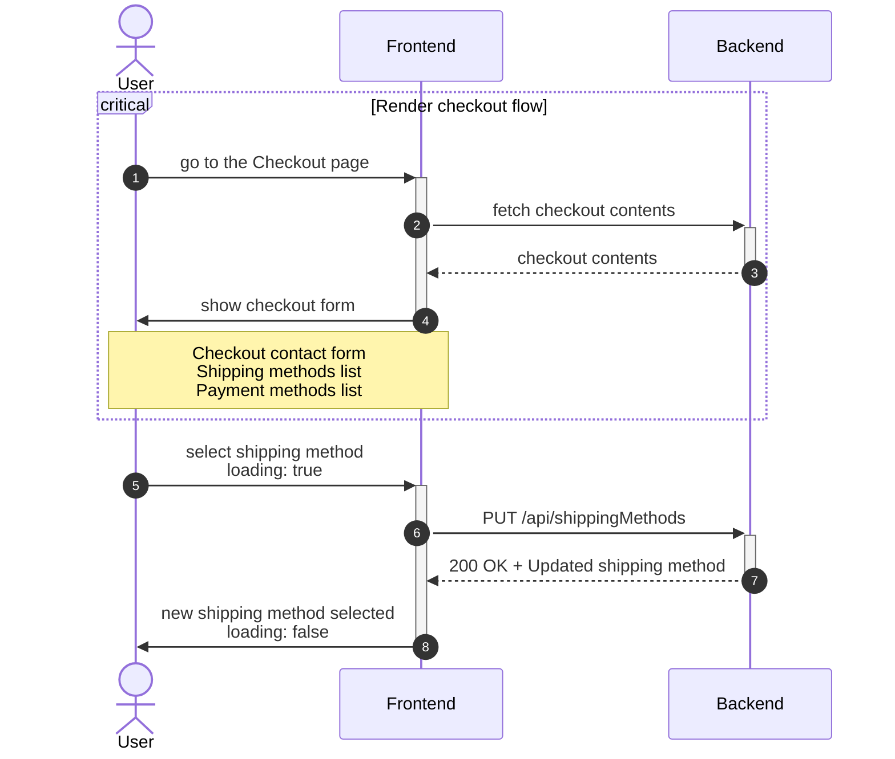

# Sequence diagram

```mermaid
sequenceDiagram
  %% Show the step number
  autonumber

  actor User
  participant Frontend
  participant Backend

  critical Render checkout flow
  User ->>+Frontend: go to the Checkout page
  Frontend ->>+Backend: fetch checkout contents
  Backend -->>-Frontend: checkout contents
  Frontend ->>-User: show checkout form
  Note over Frontend, User: Checkout contact form <br/> Shipping methods list <br/> Payment methods list
  end

  %% Update shipping method flow
  User ->>+Frontend: select shipping method <br/> loading: true
  Frontend ->>+Backend: PUT /api/shippingMethods
  Backend -->>-Frontend: 200 OK + Updated shipping method
  Frontend ->>-User: new shipping method selected <br/> loading: false
```